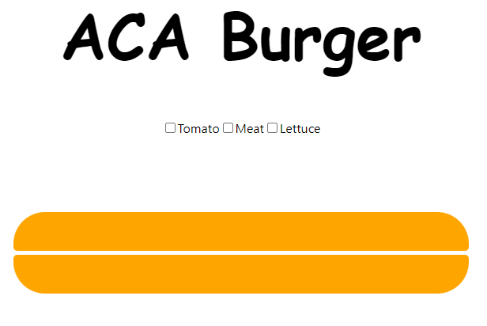
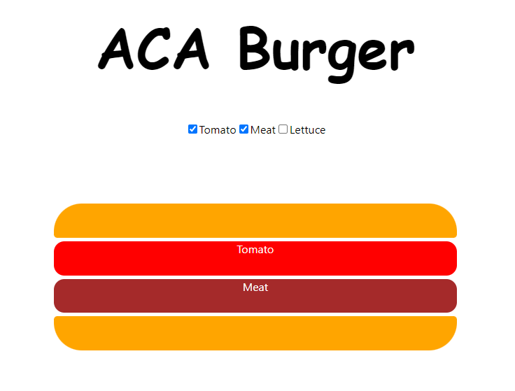

# Burger

This is a simple web app that allows you to create a burger. 
You can add ingredients to your burger and remove ingredients. 
The app will then display the burger as you create.

# Running The App Locally
- Clone the repo
- Run ***npm install***
- Run ***npm start***
- View the app on your browser at ***localhost:3000***
## Link To Heroku App
[View The Deployed App Here](https://aca-burger.herokuapp.com/)

### *The Burger Without Ingredients*

### *The Burger With Ingredients*

